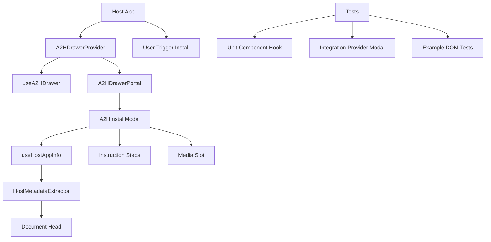
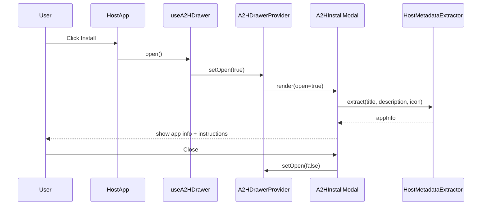

# a2h-drawer Design

## Overview

a2h-drawer は、iOS ブラウザで PWA を利用するユーザーが「ホーム画面に追加（Add to Home Screen）」の導線に迷う課題を解消するために、アプリ内の任意の箇所から呼び出せるグローバルモーダルと、それを制御する Hooks/コンポーネントを提供する UI ライブラリである。モーダルは、ホストアプリ（このライブラリを組み込んだサイト）の favicon・title・description を自動取得して表示し、A2HS の手順を iOS ライクな UI/アニメーションで提示する。

設計の中心は「Provider + Hook によるグローバル状態管理」「Portal を用いたどこからでも表示できるモーダル」「ホスト DOM からのアプリ情報抽出アダプタ」「Bun を前提としたテスト戦略（happy-dom）」である。

### Goals

- どのコンポーネントからでも簡単にモーダルを開閉できる（4.7, 4.8）
- A2HS 手順を明確に表示し、アプリ情報（アイコン/名称/説明）を自動取得して提示する（3.1〜3.4, 5.1〜5.6, 7.1〜7.4）
- iOS ライクな見た目とアニメーションを提供し、reduced motion を尊重する（6.1〜6.6）
- lib 側 unit/integration と example 側 DOM 検証テストで回帰を防ぐ（9.1〜9.9）

### Non-Goals

- iOS のネイティブ API（実際の A2HS 実行）を自動化すること（手順案内に限定）
- すべてのブラウザで liquid glass 表現を完全一致させること（段階的劣化を許容）
- 動画の「実再生」までを全環境で完全保証すること（9.8 は “再生開始が試行される” を最低ラインとし、任意で E2E を補完）

## Architecture

### Architecture Pattern & Boundary Map



- Selected pattern: Provider + Hook + Portal（UI 層の境界は Provider を中核）
- Domain/feature boundaries:
  - UI 表示: `A2HInstallModal` / `A2HDrawerPortal`
  - 状態管理: `A2HDrawerProvider` / `useA2HDrawer`
  - ホスト情報抽出: `useHostAppInfo` / `HostMetadataExtractor`
  - プラットフォーム判定: `useA2HEnvironment`（iOS/standalone 判定）
- Steering compliance: steering が存在しないため、一般原則（型安全・分離・テスト容易性）に従う

### Technology Stack

| Layer                    | Choice / Version                       | Role in Feature              | Notes                                  |
| ------------------------ | -------------------------------------- | ---------------------------- | -------------------------------------- |
| Runtime / Tooling        | Bun                                    | build / test / example 実行  | `bun test` を標準にする                |
| Language                 | TypeScript                             | 公開 API の型契約            | `any` 禁止                             |
| UI                       | React                                  | コンポーネント / Hooks       | peerDependency 想定                    |
| Styling                  | Tailwind CSS v4                        | iOSライクな見た目/アニメ     | `motion-safe` / `motion-reduce` を活用 |
| Modal primitive (option) | shadcn/ui + Radix                      | Dialog 機能                  | フォーカス/スクロール副作用に注意      |
| Visual effect (option)   | liquid-glass-react                     | glass 表現                   | Safari での劣化を許容                  |
| Unit test                | bun test + Testing Library + happy-dom | lib と example の DOM テスト | jsdom 前提にしない                     |
| Optional E2E             | Playwright 等                          | 動画等の実ブラウザ検証       | Bun 実行互換に制約があるため任意       |

## System Flows



## Requirements Traceability

| Requirement | Summary                            | Components                                          | Interfaces | Flows    |
| ----------- | ---------------------------------- | --------------------------------------------------- | ---------- | -------- |
| 1.1-1.4     | 起動条件/表示抑制                  | useA2HEnvironment, useA2HDrawer                     | State      | sequence |
| 2.1-2.4     | グローバルモーダル                 | A2HDrawerProvider, A2HDrawerPortal, A2HInstallModal | State      | sequence |
| 3.1-3.4     | 手順表示/メディア                  | A2HInstallModal, InstructionSteps                   | UI         | sequence |
| 4.1-4.8     | 公開API/グローバルHook             | useA2HDrawer, A2HDrawerProvider                     | State      | sequence |
| 5.1-5.6     | favicon/title/description 自動取得 | useHostAppInfo, HostMetadataExtractor               | Service    | sequence |
| 6.1-6.6     | iOSライク/アニメ/reduced motion    | A2HInstallModal styles                              | UI         | -        |
| 7.1-7.4     | モーダル内表示内容                 | A2HInstallModal                                     | UI         | sequence |
| 8.1-8.3     | example                            | /example app                                        | -          | -        |
| 9.1-9.9     | テスト                             | lib tests, example tests                            | -          | -        |

## Components and Interfaces

### Summary

| Component             | Domain/Layer | Intent                             | Req Coverage            | Key Dependencies (P0/P1)  | Contracts |
| --------------------- | ------------ | ---------------------------------- | ----------------------- | ------------------------- | --------- |
| A2HDrawerProvider     | State        | グローバル開閉状態を提供           | 2.1-2.4, 4.7-4.8        | React Context (P0)        | State     |
| useA2HDrawer          | State API    | open/close/toggle 等のシンプル API | 4.2-4.8                 | Provider (P0)             | State     |
| A2HDrawerPortal       | UI infra     | Portal でどこからでも表示          | 2.1                     | DOM (P0)                  | State     |
| A2HInstallModal       | UI           | アプリ情報 + 手順 + iOS風UI        | 2.x, 3.x, 5.x, 6.x, 7.x | Tailwind v4 (P0)          | UI        |
| useHostAppInfo        | Service      | title/description/icon の取得      | 5.1-5.6, 4.5            | Document head (P0)        | Service   |
| HostMetadataExtractor | Service      | favicon 等の抽出ロジック           | 5.1-5.6                 | Document head (P0)        | Service   |
| useA2HEnvironment     | Service      | iOS/standalone 判定                | 1.2-1.3                 | navigator/matchMedia (P0) | Service   |

### State Layer

#### A2HDrawerProvider

| Field        | Detail                                              |
| ------------ | --------------------------------------------------- |
| Intent       | グローバルモーダルの開閉状態と、操作 API を提供する |
| Requirements | 2.1, 2.2, 2.3, 2.4, 4.7, 4.8                        |

**Responsibilities & Constraints**

- open 状態・close 操作の単一ソース
- Portal/Modal のレンダリングを一貫して制御
- Provider 未設置時の挙動を安全にする（4.6 と整合）

**Contracts**: State [x]

##### State Management

```typescript
export type A2HDrawerOpenReason = "install_button" | "programmatic";

export interface A2HDrawerController {
  isOpen: boolean;
  open: (reason?: A2HDrawerOpenReason) => void;
  close: () => void;
  toggle: () => void;
}
```

- Preconditions: Provider がマウントされている
- Postconditions: `open()` 後に `isOpen === true`、`close()` 後に `isOpen === false`
- Invariants: `isOpen` は Provider 内状態と一致する

#### useA2HDrawer

| Field        | Detail                                                 |
| ------------ | ------------------------------------------------------ |
| Intent       | アプリ内の任意の箇所から `open/close` を呼べる最小 API |
| Requirements | 4.2, 4.3, 4.7, 4.8                                     |

**Responsibilities & Constraints**

- API は “シンプル” を優先（open/close/toggle/isOpen）
- Provider 未設置時は安全な no-op（または開発時警告）を仕様として固定する

**Contracts**: State [x]

##### Service Interface

```typescript
export interface UseA2HDrawerResult {
  isOpen: boolean;
  open: () => void;
  close: () => void;
  toggle: () => void;
}
```

### Service Layer

#### useHostAppInfo / HostMetadataExtractor

| Field        | Detail                                                       |
| ------------ | ------------------------------------------------------------ |
| Intent       | ホストページから title/description/icon を抽出して UI に渡す |
| Requirements | 5.1, 5.2, 5.3, 5.4, 5.5, 5.6, 4.5                            |

**Responsibilities & Constraints**

- `document.title`、`meta[name="description"]`、`link[rel~="icon"]` 等から抽出
- favicon は複数候補から優先順位付きで選定（例: apple-touch-icon → icon → shortcut icon → fallback）
- SSR 等で `document` が無い場合は抽出を試みない（4.6）

**Contracts**: Service [x]

##### Service Interface

```typescript
export interface HostAppInfo {
  title: string | null;
  description: string | null;
  iconUrl: string | null;
}

export interface HostAppInfoOptions {
  override?: Partial<HostAppInfo>;
  preferIconFilenames?: string[]; // 例: ["icon.png", "icon-192.png"]
}
```

#### useA2HEnvironment

| Field        | Detail                                                   |
| ------------ | -------------------------------------------------------- |
| Intent       | iOS ブラウザ対象か/追加済みか を判定し表示条件に反映する |
| Requirements | 1.2, 1.3                                                 |

**Responsibilities & Constraints**

- iOS 判定（UA/プラットフォーム等）は誤判定のリスクがあるため、最終的にアプリ側の制御（1.4）を優先できる設計にする
- 追加済み判定は `display-mode: standalone` / `navigator.standalone` 等を考慮する（利用可能な範囲）

**Contracts**: Service [x]

##### Service Interface

```typescript
export interface A2HEnvironment {
  isIOSBrowser: boolean;
  isStandalone: boolean;
}
```

### UI Layer

#### A2HDrawerPortal

| Field        | Detail                                                          |
| ------------ | --------------------------------------------------------------- |
| Intent       | Portal でモーダルを body 等に描画し、どこからでも同一 UI を出す |
| Requirements | 2.1                                                             |

**Responsibilities & Constraints**

- Portal 先が存在しない場合でも安全に動作する
- モーダルの “グローバル性” を担保する

#### A2HInstallModal

| Field        | Detail                                                      |
| ------------ | ----------------------------------------------------------- |
| Intent       | アプリ情報と手順を iOS 風 UI で提示し、閉じる操作を提供する |
| Requirements | 2.1, 2.2, 3.1-3.4, 5.1-5.6, 6.1-6.6, 7.1-7.4                |

**Responsibilities & Constraints**

- アプリ情報（icon/title/description）を表示（7.1）
- 手順表示 + 折りたたみ（7.2, 7.3）
- close ボタン等（7.4）
- Tailwind v4 の `motion-safe` / `motion-reduce` による reduced motion 対応（6.5）

**Contracts**: State [x]

##### Props Contract

```typescript
export interface A2HInstallModalProps {
  open: boolean;
  onOpenChange: (open: boolean) => void;
  appInfo?: HostAppInfo;
  media?: {
    kind: "image" | "video";
    src: string;
    alt?: string;
  };
}
```

## Error Handling

- `document` 未存在（SSR）: 取得処理はスキップし、`null` を返す（4.6）
- favicon/title/description 欠損: UI はフォールバック表示を行う（5.5）

## Testing Strategy

- Unit Tests（lib）:
  - `HostMetadataExtractor` の優先順位（icon の選択）を検証（5.4, 9.2）
  - `useA2HDrawer` の open/close/toggle と Provider 未設置時の挙動（4.7, 4.8）
  - `A2HInstallModal` の表示（title/description/icon/steps）と close 操作（7.1-7.4）
- Integration Tests（lib）:
  - Provider + Portal + Modal の組み合わせで、クリック→open→close が成立する（2.1-2.2）
- Example DOM Tests（/example）:
  - クリックでモーダルが開閉する（9.5）
  - icon/title/description が取得・表示される（9.6, 9.7）
  - 動画は “再生開始が試行される” ことを検証可能にする（9.8）
    - DOM テストでは `HTMLMediaElement.play` の呼び出し観測を最低ラインとする
    - 任意で実ブラウザ E2E を追加できるよう分離する（research.md の方針）
